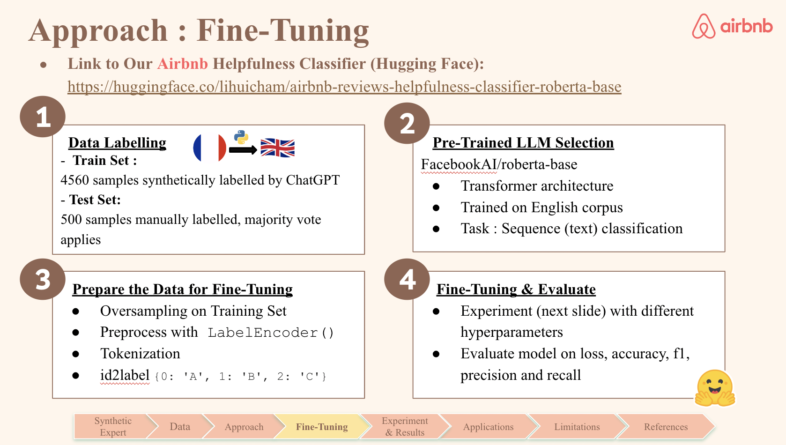
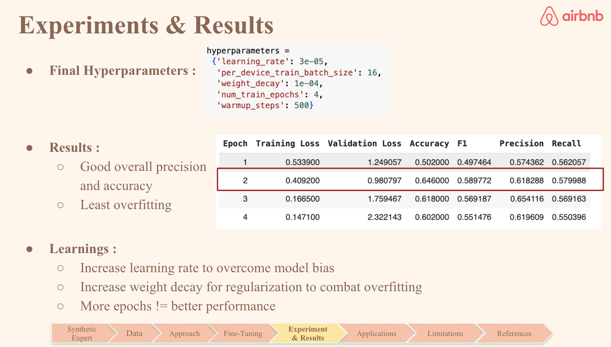
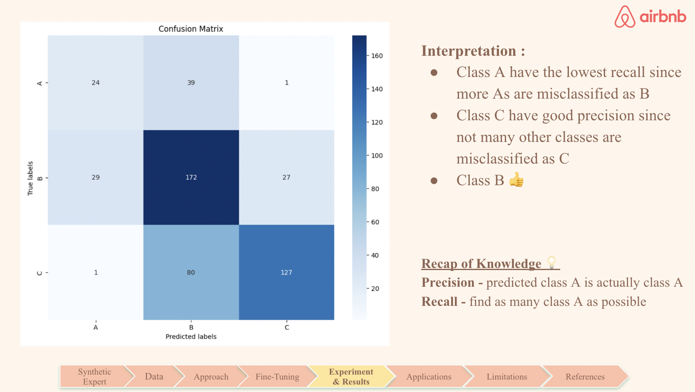
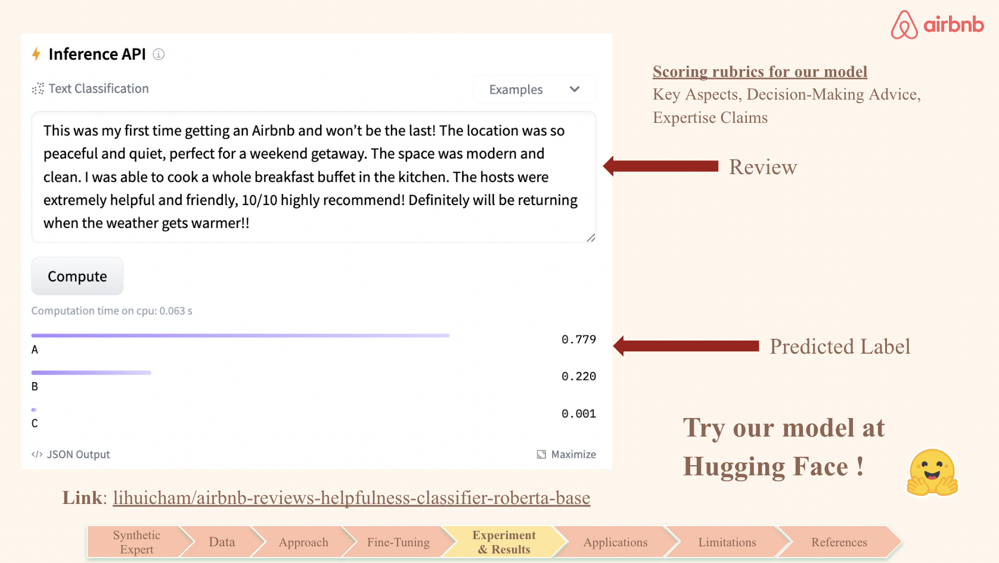
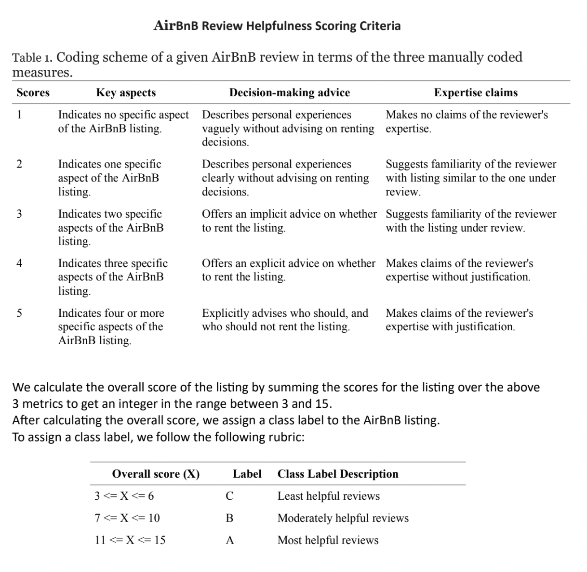

# AirBnB-Review-Helpfulness-Classifier

### Hugging Face Model
Link to hugging face model : [airbnb-reviews-helpfulness-classifier-roberta-base](https://huggingface.co/lihuicham/airbnb-reviews-helpfulness-classifier-roberta-base)

### Description
This model is an AirBnB reviews helpfulness classifier. It can predict the helpfulness, from most helpful (A) to least helpful (C) of the reviews on AirBnB website.

### Pre-trained LLM
Our project fine-tuned [FacebookAI/roberta-base](https://huggingface.co/FacebookAI/roberta-base) for multi-class text (sequence) classification. 

### Dataset
5000 samples are scraped from AirBnB website based on `listing_id` from this [Kaggle AirBnB Listings & Reviews dataset](https://www.kaggle.com/datasets/mysarahmadbhat/airbnb-listings-reviews). Samples were translated from French to English language.  

Training Set : 4560 samples synthetically labelled by GPT-4 Turbo. Cost was approximately $60.

Test/Evaluation Set : 500 samples labelled manually by two groups (each group labelled 250 samples), majority votes applies. A scoring rubrics (shown below) is used for labelling. 

### Training Details
```
hyperparameters =  {'learning_rate': 3e-05,
                    'per_device_train_batch_size': 16,
                    'weight_decay': 1e-04,
                    'num_train_epochs': 4,
                    'warmup_steps': 500}
```

We trained our model on Colab Pro which costed us approximately 56 computing units. 

This fine-tuned roberta-based model is a text classifier to predict the helpfulness of AirBnB reviews. 

### Slides







Collaborators:
Li Hui Cham, Nicholas Wong, Isaac Sparrow, Christopher Arraya, Lei Zhang, Leonard Yang

Credit to my wonderful teammate Li Hui for organizing our work 
